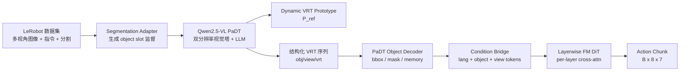
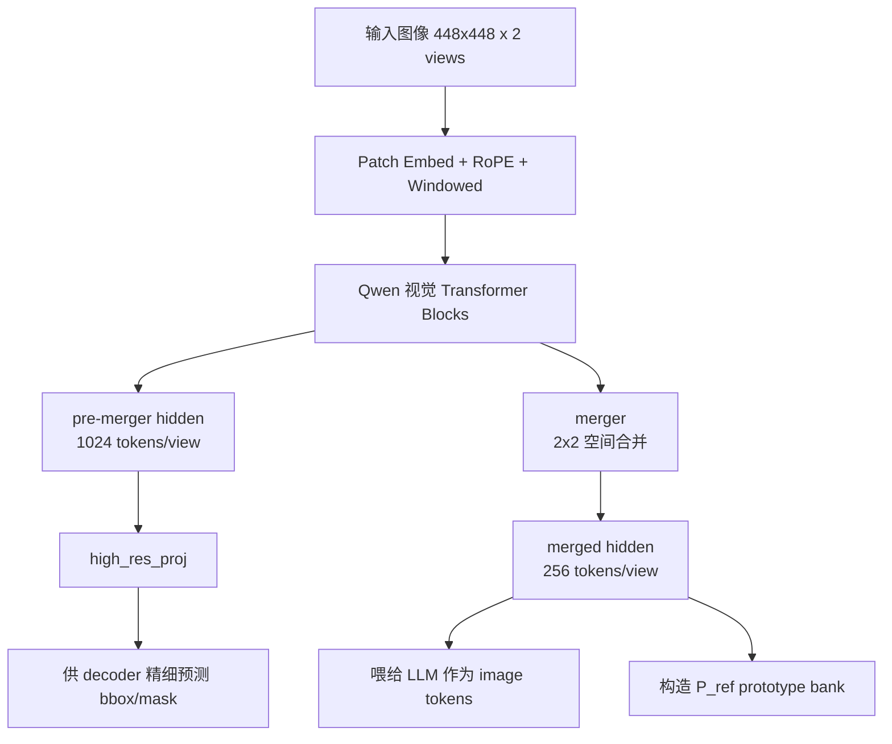
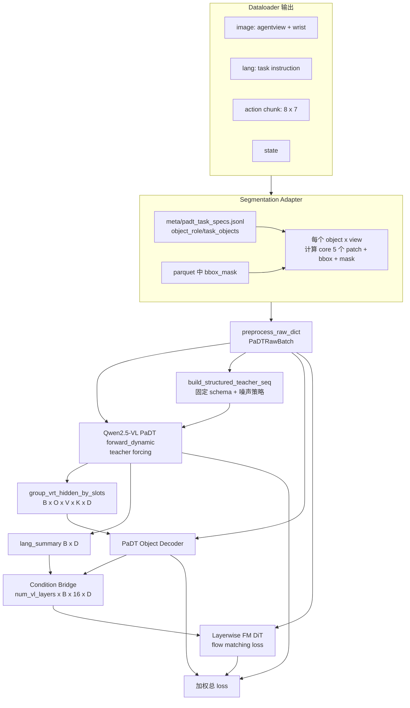
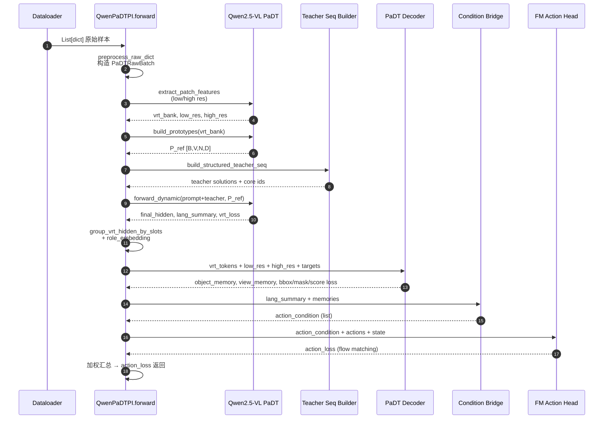
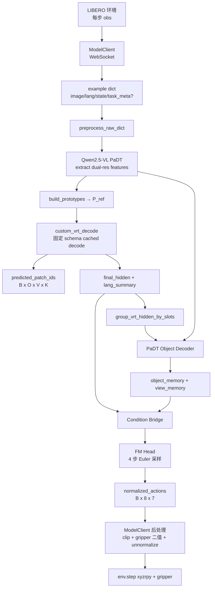
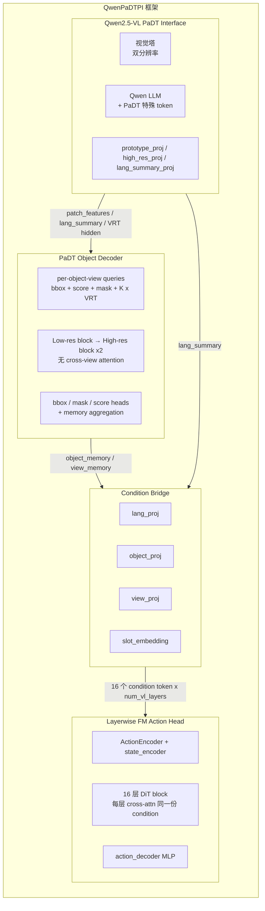
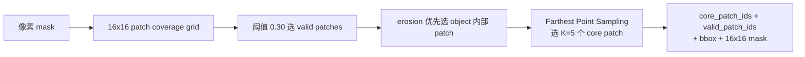
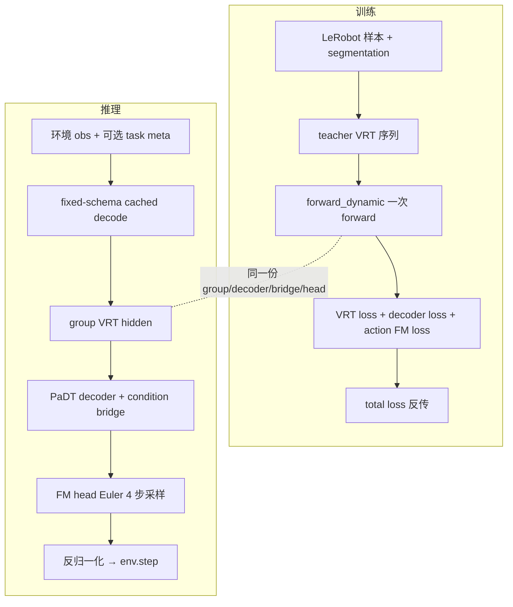

# QwenPaDTPI 训练与推理流程说明

> 本文档面向汇报演示，聚焦设计思路、模块协作、数据流与训练/推理流水线，刻意省略底层张量计算与单文件代码细节。
>
> 涉及代码主要在：`starVLA/model/framework/QwenPaDTPI.py`、`starVLA/model/modules/vlm/QWen2_5_PaDT.py`、`starVLA/model/modules/vlm/padt_object_decoder.py`、`starVLA/model/modules/action_model/PaDTConditionBridge.py`、`starVLA/model/modules/action_model/LayerwiseFM_ActionHeader.py`、`starVLA/dataloader/padt_segmentation_adapter.py`。

---

## 1. 设计动机：为什么把 PaDT 引入 starVLA

传统 VLA（vision-language-action）模型把整张图片压成几百个 patch token 直接喂给 LLM/action head，存在两个痛点：

1. **指令里提到的物体在 visual token 序列里没有"身份"**：模型必须从大量背景 patch 中重新发现"杯子在哪里、抽屉在哪里"，导致 grounding 不稳定。
2. **action head 拿到的视觉信息是 anonymous patches**：动作生成依赖于对几个关键物体的精确空间记忆，这种"无指代的整图特征"是次优条件。

**PaDT（Patch-as-Decodable-Token）** 的思想：让 LLM 直接输出指向"图像 patch 的引用 token (VRT, Visual Reference Token)"。每个 VRT token 本质上是 "这件事跟图像第 k 个 patch 有关" 的指针。再由下游 decoder 把这些指针展开成 bbox / mask / object-centric memory，提供给 action head 作为高质量条件。

**QwenPaDTPI** 把这一思想落到 starVLA 的 `Qwen2.5-VL-3B + Flow-Matching DiT` 框架里，专门针对 **双视角**（agentview + wrist）和 **固定 object slot** 的机器人任务。

---

## 2. 系统总览



**关键设计 takeaway：**

- **物体居中**：每个 `(object slot, view)` 在 LLM 序列里都有固定的 token 占位，模型 5 个 VRT 槽位即可锁定该物体在该视角的关键 patch。
- **双分辨率**：低分辨率 patch（256 / view）供 LLM 决策 + 投影回 prototype；高分辨率 patch（1024 / view）供 decoder 精细化 bbox/mask。
- **解耦三段式**：VLM 负责"看哪里"，decoder 负责"框/分割并产生物体记忆"，action head 负责"做什么"。三者之间通过 prototype + memory + condition token 解耦。

---

## 3. 核心设计思想

### 3.1 PaDT 动态 VRT 词表

LLM 词表中新增的特殊 token：

| 类别 | 含义 | 数量 |
|------|------|------|
| `<\|padt_begin\|>` / `<\|padt_end\|>` | 解决方案区段标记 | 2 |
| `<\|obj1\|> ... <\|obj4\|>` | 物体槽位（固定 4 个） | `O=4` |
| `<\|view_agentview\|>` / `<\|view_wrist\|>` | 视角槽位 | `V=2` |
| `<\|padt_vrt_000\|> ... <\|padt_vrt_255\|>` | 指向 256 个低分辨率 patch | `N=256` |
| `<\|padt_null\|>` | 缺失槽位占位 | 1 |

**关键："VRT token 的 embedding 不是从词表读的"**，而是从当前 batch 的视觉 token 池实时构造：

```
P_ref[b, view, k, :] = MLP(visual_token[b, view, k, :])    # B x V x N x D
```

每次 forward 都用 `P_ref` 替换 LLM 中 VRT token 的输入 embedding，同时用 `hidden @ P_ref.T` 计算 VRT 输出 logits。**这意味着 VRT 词表是 per-sample 动态绑定到当前图像的**——模型选择某个 VRT id，等价于"选择当前图像的第 k 个 patch"。

### 3.2 固定 schema 的结构化输出

assistant 解决方案使用严格固定 schema：

```text
<|padt_begin|>
  <|obj1|>  <|view_agentview|> VRT VRT VRT VRT VRT
            <|view_wrist|>     VRT VRT VRT VRT VRT
  <|obj2|>  ...
  <|obj3|>  ...
  <|obj4|>  ...
<|padt_end|>
```

每个样本最多监督 `4 × 2 × 5 = 40` 个 VRT token。缺失槽位用 `<|padt_null|>` 占位。

**为什么固定 schema？** 推理时无需任何语法解析，可以做 cached autoregressive decode（K-V cache 全程复用），并且强制控制 token，使得每一步只需要采样 VRT，节省大量解码时间。

### 3.3 双分辨率视觉路径

PaDT 既需要 LLM 能"思考"（低分辨率 token, 256 / view, hidden_dim 2048），又需要 decoder 能"看清"（高分辨率 token, 1024 / view, 同样投影到 2048）。



### 3.4 物体级 decoder 与 action 解耦

VRT 只产生"指针"，但 action head 需要的是"物体级别的特征向量"。引入 PaDT Object Decoder：

- 对每个 `(object, view)` 构造一组 query：`[bbox_token, score_token, mask_token, VRT_1, ..., VRT_K]`
- query 只与对应 view 的图像 memory 做 cross-attention，**view 之间不共享 attention**
- 输出 bbox / mask / score 以及聚合后的 `object_memory[B, O, D]` 与 `object_view_memory[B, O, V, D]`

这些向量进一步被 `PaDTConditionBridge` 投影成 16 个 condition token，作为 DiT action head 每一层的 cross-attention KV。

---

## 4. 训练流程

### 4.1 数据流



### 4.2 训练时序



### 4.3 五种损失共训

| Loss | 由谁产生 | 监督什么 | 权重（默认） |
|------|----------|----------|--------------|
| `L_action` (flow matching) | DiT action head | 8 步动作 chunk 的速度场 | `1.0` |
| `L_vrt` (masked NLL) | LLM 输出 + P_ref | teacher VRT patch id | `0.1` |
| `L_bbox` (L1 + GIoU) | Decoder bbox head | 每个 visible (obj, view) 的归一化框 | `0.25` |
| `L_mask` (Dice + Focal) | Decoder mask head | 高分辨率 patch coverage | `0.25` |
| `L_score` (MSE) | Decoder score head | detached GIoU（可见时） | `0.1` |

`L_total = ∑ λ_i · L_i` 直接作为 `action_loss` 返回给 trainer。

### 4.4 VRT loss 细节（设计上的小巧思）

- LLM 是 causal LM：要监督位置 `label_pos` 的 VRT token，得用 `label_pos - 1` 的 logits。
- "valid but not core" patch（同一物体的其他有效 patch）的 logit 被设为 `-inf`：避免让模型在一个物体的多个同等有效 patch 之间内卷，**只跟非有效 patch 竞争**——这是与原版 PaDT 对齐的关键 trick。
- 可选 `noisy_teacher_probability`：以一定概率把 teacher 的 core ids 从 valid set 重新采样，提升泛化（用于二阶段）。
- 可选 `use_sampled_branch`：训练时额外跑一遍 eval-style autoregressive VRT decode，加 weighted action loss 减小 train/eval gap（用于三阶段）。

### 4.5 三阶段训练计划

```text
Stage A — warmup
  noisy_teacher_probability = 0.0
  use_sampled_branch = false
  目标：让 decoder 与 VRT loss 对齐

Stage B — noisy teacher joint
  noisy_teacher_probability = 0.05 ~ 0.15
  目标：减弱对 teacher 唯一 core patch 的过拟合

Stage C — sampled branch（可选）
  use_sampled_branch = true
  sampled_branch_weight = 0.25
  目标：缩小 train/eval 之间的 VRT 自采样 gap
```

### 4.6 不同模块的差异化学习率

| 模块 | 学习率 |
|------|--------|
| `qwen_vl_interface` | `1e-5` |
| `padt_decoder` | `5e-5` |
| `condition_bridge` | `5e-5` |
| `action_model` | `1e-4` |
| base | `2.5e-5` |

设计思路：VLM 已经预训练充分、小步微调；decoder/bridge/action 三个从零训练的新模块给较高 lr。

---

## 5. 推理流程

### 5.1 推理 vs 训练的关键差异

| 维度 | 训练 | 推理 |
|------|------|------|
| VRT 序列 | teacher forcing（一次性 forward） | fixed-schema cached autoregressive decode |
| object metadata | 来自 segmentation adapter | task meta 注入 或 fallback 到 `slot_1..slot_4` |
| visibility | 来自 dataset target | 用 `object_presence_mask` 作 proxy |
| 损失 | 5 个 loss 联合反传 | 不计算 loss，只采样动作 |
| 动作生成 | flow matching loss 训练目标速度 | Euler integration 4 步从噪声出动作 |

### 5.2 数据流



### 5.3 Fixed-Schema Cached Decode

`custom_vrt_decode` 严格按以下顺序逐 token 喂进 Qwen 并维护 KV cache：

```text
1. 强制 <|padt_begin|>
2. for obj_idx in 0..3:
     a. 强制 <|obj_i|> 或 <|padt_null|>（按 object_presence_mask）
     b. for view_idx in 0..1:
        - 强制 <|view_*|>
        - 重复 K=5 次：
            · 用最近 hidden 与 P_ref[view] 算 dynamic VRT logits
            · argmax 选 patch id
            · feed 回 LLM
3. 强制 <|padt_end|>
```

整个过程 **没有 free-running 任何控制 token**，只在 5 个 VRT 位置做采样。一次 episode 仅在每步做 ~41 次 cached forward，速度可控。

### 5.4 推理时 object_memory 的对齐技巧

训练时 decoder 收到 `target_visible_by_view`，缺席物体的 `object_memory` 被 mask 成 0。推理时没有真值可见性，直接平均会让 absent slot 漏出一个非零 memory，把 action head 引到训练中没见过的分布上。

**解决方案**：用 `object_presence_mask` 在两个 view 维度上做广播作为 visibility proxy → present slot 视为两个 view 全可见，absent slot 全部屏蔽。这一处约 10 行代码，但对动作稳定性影响显著。

### 5.5 ModelClient 端的后处理

1. 缓存当前 action chunk（避免每步重新做一次完整模型推理）；
2. normalized action 在 `[-1, 1]` 范围内 clip；
3. gripper 通道按阈值二值化（0/1 → 解析成开/合命令）；
4. 用 `dataset_statistics.json` 反归一化；
5. 拆成 LIBERO 期望的 `world_vector / rotation_delta / open_gripper`；
6. 最终拼成 `[x, y, z, roll, pitch, yaw, gripper]` 给 `env.step`。

---

## 6. 模型框架结构总览



**模块职责一览：**

| 模块 | 输入 | 输出 | 角色 |
|------|------|------|------|
| Qwen2.5-VL PaDT | image, instruction, role | low/high patch feats, VRT hidden, lang_summary | 看图 + 决策"指哪里" |
| Prototype Bank | low-res visual tokens | `P_ref [B,V,N,D]` | 把 VRT 词表动态绑到当前图像 |
| PaDT Object Decoder | VRT hidden + dual-res memory | bbox / mask / object_memory | 把指针展开成几何/特征 |
| Condition Bridge | lang_summary + object/view memory | per-layer 16 tokens | 打包成 DiT 的 KV |
| FM DiT Action Head | condition tokens + state + noisy traj | velocity (训练) / action chunk (推理) | 把 condition 翻译成动作 |

---

## 7. 数据准备（PaDT 监督的来源）

### 7.1 任务级元数据

`meta/padt_task_specs.jsonl` 每行一条 task spec：

```text
task_index
task          # 文字描述
objects       # 场景中所有可参考物体
task_objects  # 与当前任务最相关的 4 个固定槽位
object_role   # 每个 object 的语义角色 (primary/secondary/...)
```

### 7.2 step 级分割数据

parquet 中存在 `segmentation.agentview_bbox_mask` / `segmentation.wrist_bbox_mask`，每条记录给出当前步每个 object 的 bbox & 像素 mask。

### 7.3 PaDT 监督生成（per sample, per object, per view）



最终给 `PaDTRawBatch` 提供：

- `target_core_patch_ids [B, O, V, K]`
- `target_valid_patch_mask [B, O, V, N]`
- `target_patch_masks_by_view [B, O, V, N]`
- `target_boxes_by_view [B, O, V, 4]`
- `target_visible_by_view [B, O, V]`
- `object_presence_mask [B, O]`

如果某 step 完全没有 object metadata，inference 会 fallback 到 `slot_1..slot_4` 4 个匿名槽位（保持 schema 不变）。

---

## 8. 训练/推理流水线对照



**复用比例：** 训练 / 推理 在 `group_vrt_hidden → decoder → bridge → action head` 阶段是 **完全同一段代码**；差异只在 VRT 序列怎么来（teacher forcing vs autoregressive decode）和损失/采样部分。

---

## 9. 关键超参数速查

| 名称 | 默认值 | 含义 |
|------|--------|------|
| `O = max_task_objects` | 4 | 每条样本最多监督 4 个 object slot |
| `V = decoder_num_views` | 2 | agentview + wrist |
| `K = num_core_vrt_tokens` | 5 | 每个 (obj, view) 输出 5 个 VRT |
| `N = num_vrt_tokens` | 256 | 每个 view 的低分辨率 patch 数 |
| `HN = high_res_tokens_per_view` | 1024 | 每个 view 的高分辨率 patch 数 |
| `D = vl_hidden_dim` | 2048 | LLM 隐层维度 |
| `H = action_horizon` | 8 | 动作 chunk 长度 |
| `A = action_dim` | 7 | xyz + rpy + gripper |
| `num_vl_layers` | 16 | Qwen layer 数 = DiT 层数 |
| `num_inference_timesteps` | 4 | Euler integration 步数 |
| `bridge_max_condition_tokens` | 16 | DiT 每层 cross-attn 的 token 上限 |

---

## 10. 总结与汇报要点

1. **PaDT 把"图片指针"显式写进 LLM 输出**，让 VLA 从"看完整张图"升级为"先指到物体，再生成动作"。
2. **双视角 × 固定 slot × 5 个 core VRT** 是稳定监督的关键：序列结构完全可枚举、可缓存、可批训。
3. **双分辨率视觉路径**：低分给 LLM 决策、高分给 decoder 精细化，二者通过 prototype + projection 解耦。
4. **三段式管线**：VLM（看 + 选 patch）→ Object Decoder（展开成 bbox/mask/memory）→ Flow-Matching DiT（产生动作），各自承担明确角色，便于独立调优。
5. **训练用 teacher forcing 一次 forward，推理用 cached fixed-schema decode**，二者下游模块共享，工程上简洁。
6. **5 个 loss 共训** + **三阶段 noisy/sampled 策略** + **模块差异化 lr**，是当前能在 LIBERO 上跑稳的核心训练配方。
