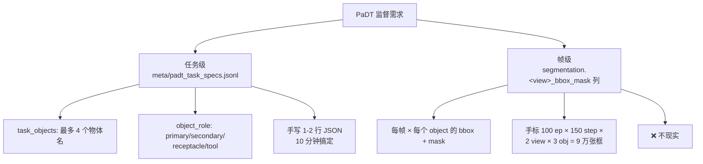
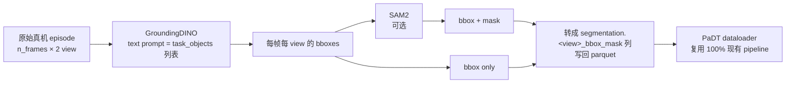
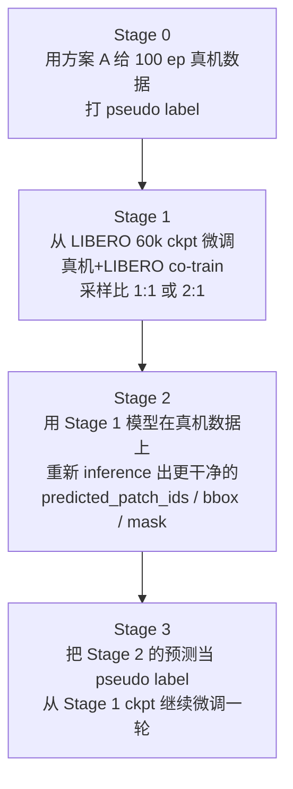

# 真机迁移与 PaDTPI 微调指南

> 本文档面向已经在 LIBERO 上训好 `QwenPaDTPI` 模型、准备把这套方法搬到真机任务（分拣螺丝、摆放餐具等）的同学。覆盖三件事：
>
> 1. **训练策略**：是从头训还是接着 LIBERO 权重微调？
> 2. **缺乏物体先验信息时怎么办**：真机数据没有 segmentation / bbox / object_role 标注，PaDT 监督还能用吗？
> 3. **可执行的落地路线图**：从数据准备到 fine-tune 到真机评估的完整步骤。

---

## 1. 数据现状评估

假设你的真机数据规模如下（典型 case）：

| 任务 | demo 数 | 每条平均步数 | 视角 |
|---|---|---|---|
| 分拣螺丝 | 50 | ~150 | agentview + wrist |
| 摆放餐具 | 50 | ~200 | agentview + wrist |
| **合计** | **100 episodes** | ~17500 steps | — |

对比 LIBERO 一个 suite 的训练规模：

| 数据集 | episodes | total steps |
|---|---|---|
| LIBERO 单个 suite | ~500 ep × 10 task = 5000 ep | ~500K+ |
| 你的真机数据 | 100 ep | ~17.5K |

**结论：你的真机数据量大约是 LIBERO 单 suite 的 1/40。** 在这个规模下，**从头训练一个 3B VLM-based VLA 基本必然失败**（要么严重过拟合、要么 PaDT 4 个辅助损失无法收敛）。

---

## 2. 训练策略：必须 fine-tune from LIBERO，不要 from scratch

### 2.1 为什么不能从零训

- VLM-based VLA 从零训需要 **百万级** demo（pi0、RT-2、OpenVLA 都是这个量级）。100 ep 差 4–5 个数量级。
- PaDT 的 4 个辅助监督（VRT NLL / bbox L1+GIoU / mask Dice+Focal / score MSE）需要 **稳定梯度** 才会收敛。数据少 + 标注噪声大时这些 loss 直接发散。
- 总参数量 ≈ 3.5B（Qwen2.5-VL 3B + PaDT decoder + 16-layer DiT），在 100 episode 上拟合纯属 train loss 看着像 0.001、eval 全失败。

### 2.2 推荐方案：在 LIBERO 60k ckpt 上接着微调

**好处：**

- VLM 已经被训得 "会看机械臂场景 + 会按 chunk 输出"，省掉 80% 的训练量。
- PaDT decoder + condition bridge + action head 已经知道 "怎么从 PaDT memory 生成动作 chunk"，只需要适配 **新的物体语义** 和 **真机视觉/动作分布**。
- 实测在 sim → real 场景下，5k–20k 步 fine-tune 通常就能拿到可用策略；从头训 100k+ 步且很可能不收敛。

### 2.3 微调前必须确认 3 个兼容性

| 维度 | LIBERO 60k ckpt 现有值 | 你的真机一致吗？ | 不一致怎么办 |
|---|---|---|---|
| **`action_dim`** | 7 (xyz + rpy + gripper) | 6-DOF EE 增量 + 1 grip → ✅ | 7-DOF joint → 改 yaml + 重置 `action_encoder` + `action_decoder` 两个 MLP |
| **`state_dim`** | 8 (eef_pos[3] + axisangle[3] + gripper_qpos[2]) | 通常不一样 | 单独重置 `state_encoder` 一个 MLP，其他权重保留 |
| **相机视角** | agentview + wrist（**必须 2 个**） | wrist 必须有 | 若无 wrist：要么手动改 `decoder_num_views=1`，要么用占位（不推荐） |
| **action 归一化** | LIBERO `dataset_statistics.json` | **不能复用** | 在真机数据上重新算 mean/std/quantile，否则 fine-tune 第一步 explode |

---

## 3. 没有物体先验信息怎么办

PaDT 训练时需要两层标注：



任务级是 10 分钟手写就能完成的小工作，**真难题是帧级的 segmentation 标注**。下面给出 3 种现实方案。

### 3.1 方案对比

| 方案 | 标注成本 | 训练效果 | 工程复杂度 | 推荐场景 |
|---|---|---|---|---|
| **A. Grounding 模型自动 pseudo label** | 1–2 天工程 | 接近完整 PaDT | 中 | ⭐ 推荐主力 |
| **B. 关闭 PaDT 辅助 loss，仅训 action FM** | 0 | 退化为 vanilla VLA，丢 PaDT 优势 | 低 | 时间紧 / 先打通 pipeline |
| **C. A + B 混合：co-train + 自蒸馏** | 同 A | 最优 | 高 | 项目周期长，追求 SOTA |

### 3.2 方案 A：用预训练 grounding 模型批量自动打 pseudo label

利用文本可控的开放词表检测/分割模型，把任务级清单当作 "prompt" 自动检测。

**候选模型对比：**

| 模型 | 输出 | 优点 | 缺点 |
|---|---|---|---|
| **GroundingDINO** | bbox（text-conditioned） | 速度快、词表灵活 | 仅 bbox，没 mask |
| **Grounded-SAM2** | bbox + mask + 跨帧追踪 | 视频时序稳定，mask 自动传播 | 部署复杂、显存大 |
| **Florence-2** | bbox + caption（仓库 in-tree） | 不用额外装依赖 | 精度略低 |
| **OWL-ViTv2 + SAM2** | bbox + mask | 长尾词表表现好 | 两阶段，速度慢 |

**数据流：**



**典型工程：**

```python
# 伪代码：tools/build_padt_segmentation_from_grounding.py
for episode_parquet in dataset.episodes:
    task_spec = load_task_spec(episode_parquet.task_index)
    text_prompt = " . ".join(task_spec["objects"])    # GroundingDINO 的 "a . b . c" 格式
    for frame in episode:
        for view in ["agentview", "wrist"]:
            bboxes, labels = grounding_dino(frame[view], text_prompt)
            masks = sam2(frame[view], bboxes)         # 可选
            obj_records = build_bbox_mask_records(bboxes, masks, labels, task_spec)
            frame[f"segmentation.{view}_bbox_mask"] = json.dumps(obj_records)
    save_back(episode_parquet)
```

**应对噪声的两个关键开关：**

```yaml
datasets:
  vla_data:
    padt_valid_patch_threshold: 0.20    # 对 noisy pseudo label 放宽（原 0.30）

framework:
  padt:
    noisy_teacher_probability: 0.15     # 训练时主动扰动 teacher，吸收 label 噪声
```

Grounded-SAM2 的 **video 模式** 能让 mask 在 episode 内自动追踪，能把单帧漏检/抖动的问题缓解大半，强烈推荐。

### 3.3 方案 B：关掉 PaDT 辅助损失，只训 action FM loss

如果先要快速打通真机数据通路、暂时不想做 grounding 工程，可以把 PaDTPI **退化为 "加了 PaDT 模块但不用它们监督" 的 vanilla VLA**：

```yaml
framework:
  padt:
    loss_weights:
      act:   1.0
      vrt:   0.0     # ← 关
      bbox:  0.0     # ← 关
      mask:  0.0     # ← 关
      score: 0.0     # ← 关
```

**代价：**

- 模型仍然走 VRT 自回归 decode（结构没改），但 VRT id 没有监督，自由选 patch，相当于 "随机指针"。
- 实际等价于一个加了若干无监督指针 token 的 vanilla VLA，**丢掉 PaDT 的全部优势**。
- **能跑、能收敛、不需要任何 segmentation 标注**。

适合的场景：

- 只想先验证真机数据通路是否打通
- 后续再补 grounding 标注，渐进升级到方案 A 或 C

### 3.4 方案 C（强烈推荐的最终形态）：两阶段 + co-train + 自蒸馏



**关键：co-train**。100 ep pseudo label 信噪比太低，单独训会让 PaDT decoder 反向退化。**用 LIBERO 高质量 label 做"锚点"**，真机数据驱动视觉分布和动作语义迁移。

dataloader 端的 sampling ratio 配置示意：

```yaml
datasets:
  vla_data:
    data_mix: libero_all+real_screw_and_tableware
    mixing_weights:
      libero_all: 1.0
      real_screw_and_tableware: 1.0   # 真机数据上采样到 1:1
```

---

## 4. 落地路线图

### Step 0：准备 LeRobot v3 格式的数据

把真机数据按 LIBERO 的目录结构整理：

```
real_robot_data/
├── screw_sorting/                ← 一个任务一个目录
│   ├── meta/
│   │   ├── tasks.parquet         ← LeRobot 标准（task_index + task 字符串）
│   │   ├── padt_task_specs.jsonl ← 手写，1-2 行
│   │   ├── episodes/             ← episode 元信息
│   │   └── stats.json            ← 真机数据归一化统计
│   ├── data/                     ← 50 ep 的 parquet
│   └── videos/                   ← 多视角 mp4
└── tableware_arrange/
    └── (同上)
```

每条 parquet 行至少要有：

```
observation.images.image_0       ← agentview
observation.images.image_1       ← wrist
observation.state                ← robot proprio
action                           ← 7-D delta action
segmentation.agentview_bbox_mask ← 由 Step 2 生成
segmentation.wrist_bbox_mask     ← 由 Step 2 生成
```

### Step 1：写 `padt_task_specs.jsonl`（10 min）

```jsonl
{"task_index": 0, "task": "Sort red and blue screws into matching trays.", "objects": ["red screw", "blue screw", "red tray", "blue tray"], "task_objects": ["red screw", "red tray", "blue screw", "blue tray"], "object_role": {"red screw": "primary", "red tray": "receptacle", "blue screw": "secondary", "blue tray": "receptacle"}}
{"task_index": 1, "task": "Arrange plate, bowl and chopsticks on placemat.", "objects": ["plate", "bowl", "chopsticks", "placemat"], "task_objects": ["plate", "bowl", "chopsticks", "placemat"], "object_role": {"plate": "primary", "bowl": "secondary", "chopsticks": "tool", "placemat": "receptacle"}}
```

注意点：

- `task_objects` 最多 4 个（要跟 `max_task_objects=4` 对齐），多了截断。
- `object_role` 词表必须在 `framework.padt.role_vocab` 列表里：`[slot_1, slot_2, slot_3, slot_4, primary, secondary, receptacle, tool]`。
- 仓库自带 `tools/build_padt_task_specs_from_tasks_parquet.py` 能从 `tasks.parquet` 生成空 scaffold，再手填即可。

### Step 2：批量打 grounding pseudo label（1–2 天工程）

写独立脚本 `tools/build_padt_segmentation_from_grounding.py`，逻辑参考 §3.2。输出列的格式跟 `add_to_each_dataset/meta/padt_task_specs.schema.json` 对齐，dataloader 已经支持这个 schema。

**质检建议：**

- 抽 10 个 episode × 5 帧人工检查 GroundingDINO 输出
- 漏检率 > 30% 时考虑：
  - 换更具体的 prompt（"small silver screw on wooden table" 替代 "screw"）
  - wrist 视角先 2× 放大裁剪再检测
  - 用 Grounded-SAM2 的 video 模式利用时序补漏

### Step 3：写 fine-tune yaml

基于 `starVLA/config/training/starvla_padtpi_libero.yaml` 改 3 处：

```yaml
# === Step 3.1: 标记 resume + 缩短训练 ===
trainer:
  resume_from: /home/users/astar/i2r/chengzy/starVLA_origin/results/Checkpoints/qwen_padtpi_libero_dualvrt_v2_4/checkpoints/steps_60000_pytorch_model.pt
  is_resume: true
  max_train_steps: 15000          # fine-tune 短一些
  num_warmup_steps: 500
  learning_rate:
    base:              5.0e-6     # 全部降一个量级
    qwen_vl_interface: 2.0e-6
    padt_decoder:      1.0e-5
    condition_bridge:  1.0e-5
    action_model:      3.0e-5

# === Step 3.2: 切到真机数据 ===
datasets:
  vla_data:
    data_root_dir: /path/to/real_robot_data
    data_mix: real_screw_and_tableware                # 或 libero_all+real_... 走 co-train
    padt_valid_patch_threshold: 0.20                  # 对 noisy pseudo label 放宽

# === Step 3.3: 应对 pseudo label 噪声 ===
framework:
  padt:
    noisy_teacher_probability: 0.15
    loss_weights:
      act:   1.0
      vrt:   0.05                                     # 降低，因为 label 不准
      bbox:  0.10
      mask:  0.10
      score: 0.05
```

### Step 4：训 → 真机评估

启动训练（4 GPU 示意）：

```bash
accelerate launch --num_processes 4 \
    starVLA/training/train_starvla.py \
    --config_yaml ./starVLA/config/training/starvla_padtpi_real.yaml \
    --framework.name QwenPaDTPI \
    --run_id qwen_padtpi_real_finetune_v1
```

真机评估只需要换 client：复用 `deployment/model_server/server_policy.py` 起服务，再写一个真机 ROS / SDK 侧的 client 调用 WebSocket 接口即可。模型不变。

### Step 5（可选）：自蒸馏迭代升级

```bash
# 用 Step 4 的模型在真机数据上 inference，把预测保存成新的 pseudo label
python tools/distill_padt_from_inference.py \
    --ckpt results/Checkpoints/qwen_padtpi_real_finetune_v1/checkpoints/steps_15000_pytorch_model.pt \
    --data /path/to/real_robot_data \
    --output /path/to/real_robot_data_v2

# 然后基于 Step 4 ckpt 继续训
```

---

## 5. 常见坑

| 坑 | 现象 | 应对 |
|---|---|---|
| **wrist 视角缺失** | `decoder_num_views=2` 写死，没有 wrist 直接 crash | 装个 wrist 相机；或改 `decoder_num_views=1` 重新 fine-tune（损失精度） |
| **action 尺度差 100×** | LIBERO 用归一化 delta_qpos，真机用米/弧度，fine-tune 第一步 NaN | 用真机数据**重新算** `dataset_statistics.json`，不要复用 LIBERO 的 |
| **state_dim 不一致** | shape mismatch crash | 重置 `state_encoder` MLP，保留其他 |
| **GroundingDINO 漏检小目标** | 螺丝、小零件检测率 < 50% | wrist 视角先放大裁剪；用更具体 prompt；上 SAM2 video 模式 |
| **gripper 二值化阈值不对** | 推理时夹爪一直张开 / 一直闭合 | 看真机 demo 数据 gripper 通道分布，重设阈值（LIBERO 默认 0.5） |
| **state history 频率错位** | 训练 vs 部署的控制频率不同 → state 序列错位 | 训练时 `state_history_len` 和部署时的 obs 频率必须对齐 |
| **co-train 时 LIBERO 数据反向干扰** | 真机指标先升后降 | 把 `mixing_weights` 中 LIBERO 权重逐步降到 0.2-0.3 |

---

## 6. 一句话总结

| 问题 | 推荐做法 |
|---|---|
| 从头训还是微调？ | **必须 fine-tune from LIBERO 60k ckpt**，100 ep 远不足以从零训 3B VLM |
| 没物体先验怎么办？ | **GroundingDINO（+ SAM2 video 模式）自动打 pseudo label**，task_specs 手写 |
| 时间紧 / 想先打通？ | 先用方案 B（关 PaDT 辅助 loss）跑通流程，再补 grounding 升级到方案 A/C |
| 追求 SOTA？ | 方案 C：grounding → co-train fine-tune → 自蒸馏迭代 |

---

## 7. 参考文件

- 现有 LIBERO PaDTPI 训练 yaml：`starVLA/config/training/starvla_padtpi_libero.yaml`
- LIBERO 训练 slurm 脚本：`examples/LIBERO/train_files/run_libero_padtpi.sh`
- 任务级 spec scaffold 工具：`tools/build_padt_task_specs_from_tasks_parquet.py`
- task spec schema 文件：`add_to_each_dataset/meta/padt_task_specs.schema.json`
- task spec 示例：`add_to_each_dataset/meta/padt_task_specs.jsonl.example`
- Segmentation adapter（数据装载）：`starVLA/dataloader/padt_segmentation_adapter.py`
- PaDTPI 架构总览：`docs/padtpi_overview_for_presentation.md`
- PaDTPI 模块细节：`docs/qwen_padtpi_current_architecture.md`
